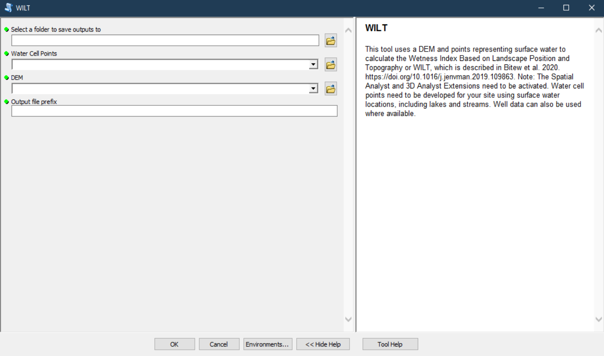

# Wetness index based on landscape position and topography (WILT): Modifying TWI to reflect landscape position

An Arcpy script to calculate WILT as described in [Wetness index based on landscape position and topography (WILT): Modifying TWI to reflect landscape position](https://doi.org/10.1016/j.jenvman.2019.109863)

## Requirements to run the script:

+ ArcGIS or the ability to run ArcPy scripts (this hasn't been tested in ArcPro)
+ Spatial Analyst extension enabled
+ 3D Analyst Extension enabled

## Instructions to run the tool in ArcGIS:

Please read the paper to fully understand the methods before trying to run the tool https://doi.org/10.1016/j.jenvman.2019.109863

+ Open Arc map
+ Navigate to and open the WILT toolbox
+ Double click the WILT tool to open it
+ Select a location to save outputs to. (the resulting WILT map)
+ Provide water cell points (a point shapefile of known surface water locations, which will be used to extract the elevation at said locations)
+ Provide a bare earth DEM for the study area
+ Give the output files a prefix to identify the run
+ Click Ok
+ If the run is successful a WILT raster will be in the output folder

## Notes:

+ If you run the tool multiple times you will need to delete the raster value field in the water points file prior to the next run or you will encounter an error at the 'extract values to points' step.
+ Make sure the 3D and Spatial Analyst extensions are enabled.
